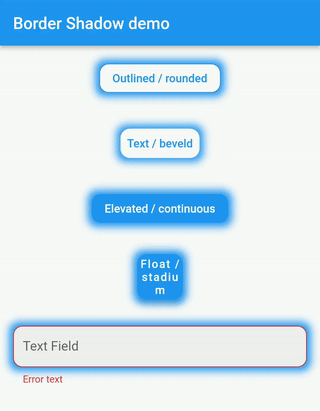
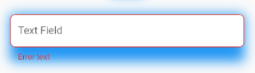
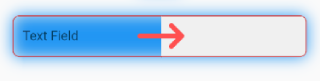
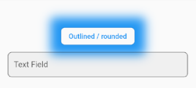

Please use the new package [https://pub.dev/packages/control_style](https://pub.dev/packages/control_style)

Adds shadows (glowing) to text fields and buttons.

## Features



To add a shadow to an input or button you usually need to wrap these components into a `Container` element that has a shadow. Such an approach increases the volume of work, complicates the code and works incorrectly in combination with `errorText` and `helperText`.



The plugin allows for adding a shadow to text fields and buttons as to a `Container`. The shadow can be added to all the controls at once via the `theme` setting of `MaterialApp`, or to separate controls through changing their styles.

## Usage

To use the plugin with inputs, you need to wrap `InputBorder` with `InputBorderShadow` and configure the `boxShadow` parameter.

For example, the code:

``` dart
    MaterialApp(
      theme: ThemeData(
        primarySwatch: Colors.blue,
        inputDecorationTheme: InputDecorationTheme(
          border: OutlineInputBorder(
            borderRadius: BorderRadius.circular(8),
          ),
        ),
      ),
    );
```

should be updated to:

``` dart
    MaterialApp(
      theme: ThemeData(
        primarySwatch: Colors.blue,
        inputDecorationTheme: InputDecorationTheme(
          border: InputBorderShadow(
            boxShadow: const [
              BoxShadow(
                color: Colors.blue,
                blurRadius: 12,
              )
            ],
            child: OutlineInputBorder(
              borderRadius: BorderRadius.circular(8),
            ),
          ),
        ),
      ),
    );
```

For buttons, you need to wrap `OutlinedBorder` with `OutlinedBorderShadow` and configure the `boxShadow` parameter.

Hence, this code:

``` dart
    MaterialApp(
      theme: ThemeData(
        primarySwatch: Colors.blue,
        outlinedButtonTheme: OutlinedButtonThemeData(
            style: ElevatedButton.styleFrom(
          shape: RoundedRectangleBorder(
            borderRadius: BorderRadius.circular(8),
          ),
        )),
      ),
    );
```

should be updated to:

``` dart
    MaterialApp(
      theme: ThemeData(
        primarySwatch: Colors.blue,
        outlinedButtonTheme: OutlinedButtonThemeData(
            style: ElevatedButton.styleFrom(
          shape: OutlinedBorderShadow(
            boxShadow: const [
              BoxShadow(
                color: Colors.blue,
                blurRadius: 12,
              )
            ],
            child: RoundedRectangleBorder(
              borderRadius: BorderRadius.circular(8),
            ),
          ),
        )),
      ),
    );
```

The examples above show how a shadow can be added to all the controls at once. 

In case you need to add a shadow to a separate element, you need to configure its styles:

``` dart

    TextField(
      decoration: InputDecoration(
          border: InputBorderShadow(
        child: OutlineInputBorder(
          borderRadius: BorderRadius.circular(8),
        ),
        boxShadow: const [
          BoxShadow(
            color: Colors.blue,
            blurRadius: 12,
          )
        ],
      )),
    );

    ...

    ElevatedButton(
      onPressed: () {},
      child: const Text("Button"),
      style: ElevatedButton.styleFrom(
          shape: OutlinedBorderShadow(
        boxShadow: const [
          BoxShadow(
            color: Colors.blue,
            blurRadius: 12,
          )
        ],
        child: RoundedRectangleBorder(
          borderRadius: BorderRadius.circular(8),
        ),
      )),
    );

```

## BorderShadow in Detail

The wrappers `InputBorderShadow` and `OutlinedBorderShadow` work by taking a control's border through the `child` parameter and draw a shadow to the border above the control. Then, to create an illusion of the shadow being located behind the control, the shadow's part that is above the control gets cut off.



## Compatibility

The following borders have been tested.

Inputs:
- UnderlineInputBorder
- OutlineInputBorder

Buttons:
- BeveledRectangleBorder
- CircleBorder
- ContinuousRectangleBorder
- RoundedRectangleBorder
- StadiumBorder

## Issues

- Inner shadows not supported.
- Shadows may overlap nearby elements.


